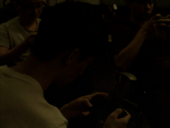
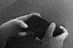

# Directing eSport Broadcast with Event Cameras

<table class="center" align="center">
    <thead class="center">
        <tr>
            <th>Scene</th>
            <th>Fine Motor Skills</th>
        </tr>
    </thead>
    <tbody class="center" align="center">
        <tr>
            <td rowspan=4></td>
            <td>with a traditional camera</td>
        </tr>
        <tr>
            <td class="center" align="center"></td>
        </tr>
        <tr>
            <td>with an event camera</td>
        </tr>
        <tr>
            <td></td>
        </tr>
    </tbody>
</table>

Code and data will be released after the research paper is published.